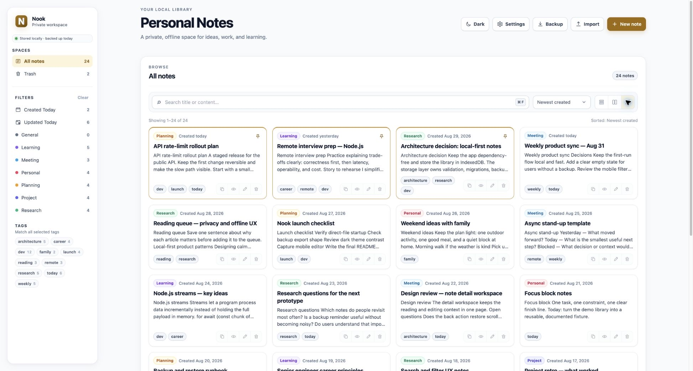
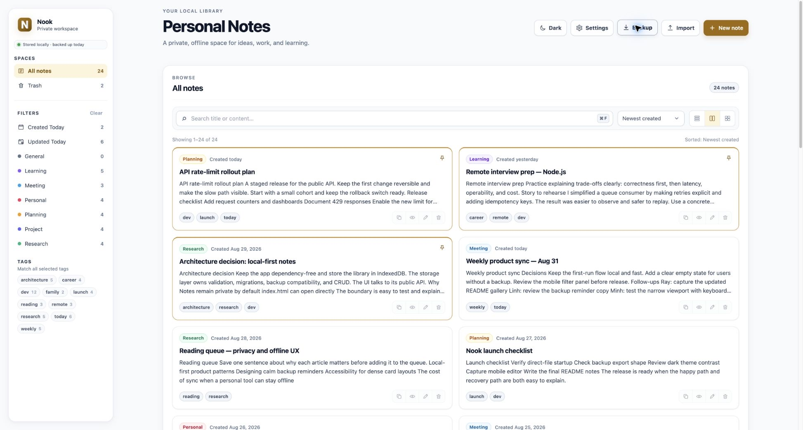
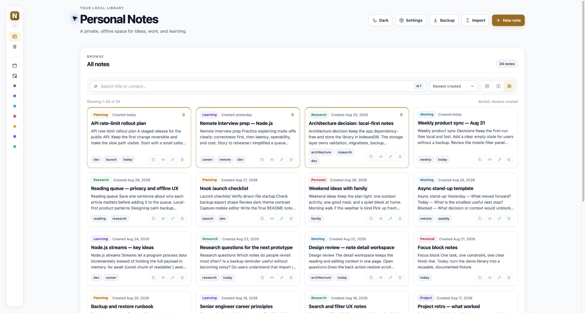
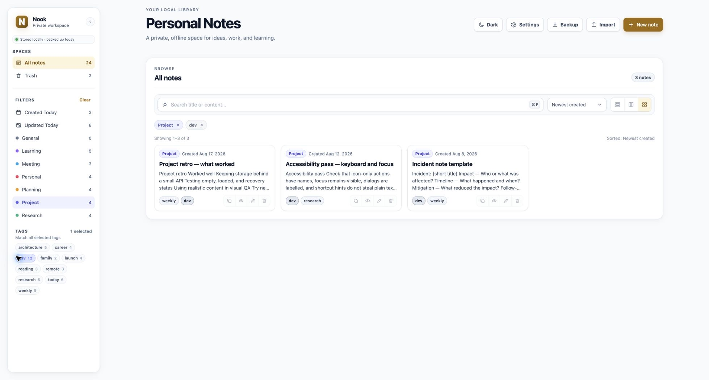
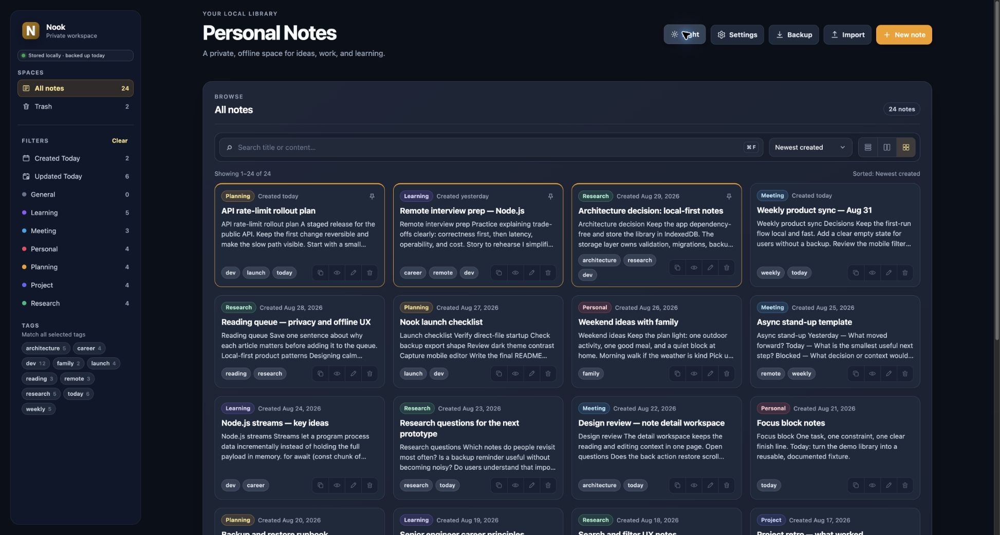
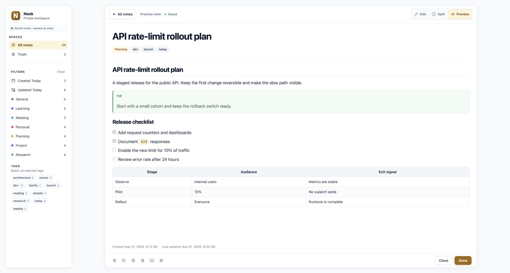
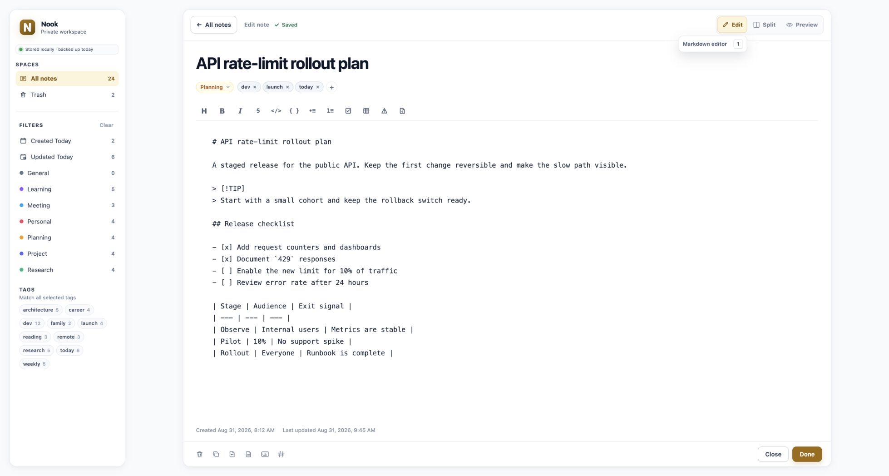
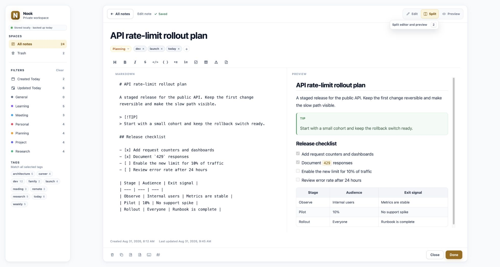
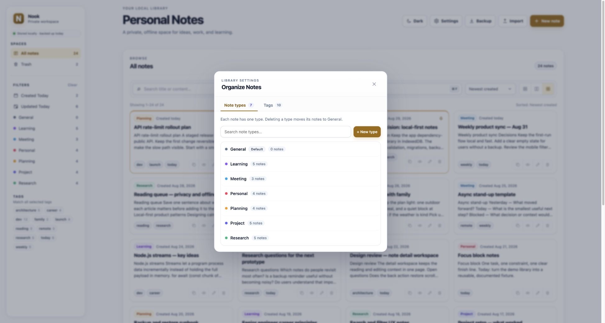
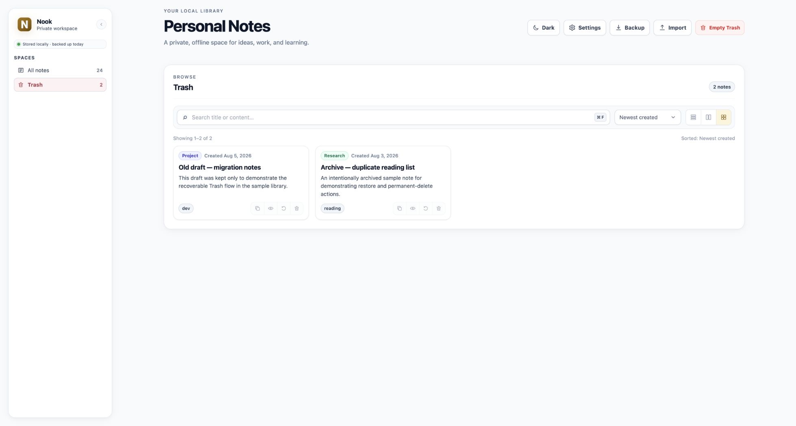

# Nook

Nook is a private, offline-first personal notes workspace. It is a static web
app made with vanilla HTML, CSS, and JavaScript. Notes stay in the current
browser's IndexedDB; there is no account, backend, sync service, analytics,
CDN, or runtime dependency.

Use it for work notes, learning material, research, project context, interview
practice, and personal ideas in one calm, searchable local library.

## Highlights

- Create and edit notes with a title, one note type, optional reusable tags, and raw Markdown.
- Open a note in the detail workspace and switch between Preview, Edit Markdown, and Split views.
- Search note titles and content without sending data anywhere.
- Combine type, multiple-tag, Created Today, Updated Today, and search filters. Multiple tags use an “all selected tags” match.
- Sort by created date, updated date, or title. Pinned notes stay above unpinned notes.
- Move notes to Trash, restore them, undo a move, permanently delete one note, or empty Trash.
- Copy the raw Markdown source or export the current note as `.md` or `.txt`.
- Export and import a complete JSON backup. The local backup-health indicator reminds you when an export is missing or old.
- Manage note types and tags from Settings → Organize Notes.
- Switch between light and dark themes, Focus, Comfortable, and Compact layouts, or collapse the sidebar into an icon rail.
- Recover an unfinished local editor draft after an interrupted session.
- Keep multiple open tabs in sync when the browser supports `BroadcastChannel`.
- Use `C` for quick capture plus platform-aware editor shortcuts for formatting, saving, and switching editor modes.

## Screenshots

The gallery uses the reusable [demo library](docs/sample-data/nook-demo-library.json):
24 active notes, 2 notes in Trash, 7 note types, 10 tags, 3 pinned notes, and
realistic Markdown content. The content is synthetic and safe to replace. Nook
stores it in the current browser's IndexedDB; no note content is sent to a
server.

### Library and navigation











### Note detail workspace







### Organization and recovery





## Quick start

Nook has no build step and no package installation. Open [`index.html`](index.html)
directly in a modern browser:

```text
index.html → Open with your browser
```

For a consistent localhost origin, you can optionally serve the repository with
any static web server:

```bash
cd nook
python3 -m http.server 8000
```

Then open <http://localhost:8000>. JavaScript is required in both modes.

`file://`, `localhost`, and different ports are separate browser origins, so
their IndexedDB and localStorage data do not transfer automatically. Export a
JSON backup before moving between origins, browsers, or browser profiles.

## Using Nook

### Create and edit a note

1. Select **New note**.
2. Enter a title and choose a note type.
3. Add existing tags or type a new tag and press Enter.
4. Write raw Markdown in the editor.
5. Select **Done** to save and close, or **Save changes** to save while keeping the editor open.

Opening a saved note's Preview action takes you to the detail workspace. Use
**Edit**, **Split**, and **Preview** in the command bar to change the surface
without losing the note context. The back action returns to the library and
restores the previous scroll position when possible.

Existing titled notes autosave after about 1.5 seconds of inactivity. A new
untitled draft is not persisted until its first explicit save. Nook also keeps
an unfinished editor draft locally so it can offer recovery after an interrupted
session. Closing a dirty editor asks before discarding changes.

### Find and organize notes

- Search the title and raw Markdown content from the library search field.
- Choose a type from the sidebar or from a note card's type badge.
- Select one or more tags. A note must contain every selected tag to match.
- Use **Created Today** or **Updated Today** for date-based review.
- Remove filters from the active-filter pills or select **Clear**.
- Choose a sort order from the toolbar. Pinned notes remain above unpinned notes.
- Use **Focus**, **Comfortable**, and **Compact** to change the card layout.
- On narrow screens, open **Filters** to reveal spaces, date filters, types, and tags without leaving the library.
- Use the sidebar toggle to keep the navigation available as a narrow icon rail.

**Settings → Organize Notes** lets you add, rename, recolor, and delete note
types and tags. Every note has one type. The built-in **General** type cannot be
deleted; notes from a deleted custom type move to General. Tags are optional and
can be shared by many notes.

### Quick View and note actions

The detail workspace provides:

- **Copy** — copies the raw Markdown source.
- **Export `.md`** — downloads the original Markdown.
- **Export `.txt`** — downloads a plain-text rendering.
- **Edit**, **Split**, and **Preview** — switch the current detail surface.
- **Close** — returns to the library.

The pin control is available on each active note card. In Trash, a note can be
restored or permanently deleted. Moving a note to Trash is recoverable until it
is permanently deleted or Trash is emptied.

### Keyboard shortcuts

The modifier is `Command` on macOS and `Control` on Windows/Linux.

| Shortcut | Action |
| --- | --- |
| `⌘/Ctrl + F` | Focus search when no modal dialog is open |
| `/` | Focus search when not already editing a field |
| `C` | Start a new note from the library when focus is not inside a form field |
| `⌘/Ctrl + B` | Toggle bold around selected editor text |
| `⌘/Ctrl + I` | Toggle italic around selected editor text |
| `⌘/Ctrl + K` | Insert a link around selected editor text |
| `1` | Switch to Markdown editor |
| `2` | Switch to Split preview |
| `3` | Switch to rendered Preview |
| `⌘/Ctrl + Shift + S` | Save changes and keep the editor open |
| `⌘/Ctrl + Enter` | Save changes and close the editor |

Shortcut and Markdown help are available from the editor footer through hover
and keyboard focus. Plain keys are scoped away from editable fields so typing
inside a note is unaffected.

## Markdown support

Nook includes a dependency-free, safe Markdown-to-DOM renderer. It supports a
broad CommonMark/GFM-style subset, including:

- ATX and setext headings; bold, italic, strikethrough, inline code, entities, and hard line breaks
- Fenced and indented code blocks with an optional language label
- Unordered, ordered, nested, and task lists
- Blockquotes and GitHub-style alerts: `NOTE`, `TIP`, `IMPORTANT`, `WARNING`, and `CAUTION`
- Inline links, reference links, autolinks, and safe `http`, `https`, `mailto`, and `tel` destinations
- Tables with alignment, footnotes, allowlisted `<details>`/`<summary>` blocks, and mathematical-expression text blocks
- Horizontal rules

This is not a claim of complete GitHub renderer parity. Math is displayed as
text rather than typeset. Remote images are represented by accessible alt text
so Nook does not load untrusted image assets. Raw HTML remains inert except for
the explicitly supported details/summary syntax, and unsafe URL schemes are
not rendered as links.

## Local data and privacy

Nook keeps the note library in the current browser profile:

- IndexedDB database: `personal-notes`
- Current database version: `2`
- Object stores: `notes`, `types`, `tags`, and `meta`
- UI preferences such as theme, sidebar state, layout, sort order, and active filters use `localStorage`

The app does not send note content to a server and does not call external APIs.
Browser site data is not a backup: clearing site data, changing browser
profiles, or using another browser can make the local library unavailable. JSON
backups are plain text and are not encrypted by Nook.

### Note data model

Each note contains:

| Field | Description |
| --- | --- |
| `id` | Stable local note identifier |
| `title` | Required title, up to 160 characters |
| `typeId` | Required reference to one note type |
| `tagIds` | Zero or more tag references |
| `content` | Raw Markdown, up to 50,000 characters |
| `createdAt` | ISO timestamp |
| `updatedAt` | ISO timestamp |
| `isPinned` | Whether the note is pinned |
| `deletedAt` | ISO timestamp when in Trash, otherwise `null` |

The storage layer owns normalization and validation. Note content is trimmed and
line endings are normalized before saving; the Markdown syntax is preserved.

## Backup, restore, and demo data

### Full library backup

Select **Backup** to download a file named like
`personal-notes-backup-YYYY-MM-DD.json`. The current format is:

```json
{
  "format": "personal-notes-backup",
  "schemaVersion": 2,
  "exportedAt": "2026-01-01T00:00:00.000Z",
  "data": {
    "noteTypes": [],
    "tags": [],
    "notes": []
  }
}
```

Select **Import** and choose a JSON file to validate it before replacing the
current library. Import is a full replacement, not a merge; the confirmation
step shows the number of notes, types, and tags that will be imported.

The [Nook demo library](docs/sample-data/nook-demo-library.json) is a reusable,
fictional sample collection for reviewing the UI, practicing import/export, and
refreshing the README gallery. It contains active notes plus two Trash records
so restore and permanent-delete states are available immediately. Import it
from the app's **Import** button whenever you need the same demo state again.

Nook accepts current schema versions `1` and `2`, older `types` naming in place
of `noteTypes`, and the legacy library shape containing `interviewQuestions` and
`protoblocNotes`. Legacy data is upgraded into the current note/type/tag model.

## Project structure

| File | Responsibility |
| --- | --- |
| [`index.html`](index.html) | Semantic page structure, accessible controls, detail workspace, and native dialogs |
| [`styles.css`](styles.css) | Layout, responsive behavior, themes, component states, and accessibility styling |
| [`storage.js`](storage.js) | IndexedDB setup, validation, migration, CRUD, Trash lifecycle, and backup import/export |
| [`markdown.js`](markdown.js) | Safe dependency-free Markdown parser and DOM renderer |
| [`app.js`](app.js) | UI state, filtering, rendering, detail workspace, editor behavior, shortcuts, and storage calls |
| [`favicon.svg`](favicon.svg) | Local Nook application icon used by the browser tab |
| [`docs/sample-data/nook-demo-library.json`](docs/sample-data/nook-demo-library.json) | Reusable fictional import/export fixture for demos and screenshot QA |
| [`LICENSE`](LICENSE) | Unlicense / public-domain dedication |

The entry point loads scripts in this order:

```text
storage.js → markdown.js → app.js
```

`storage.js` exposes the frozen `PersonalNotesStorage` API and `markdown.js`
exposes the frozen `NookMarkdown` API. The UI uses these interfaces instead of
accessing IndexedDB directly.

## Development and validation

There is no `package.json`, bundler, framework, test runner, or remote runtime
dependency. Useful static checks are:

```bash
node --check storage.js
node --check markdown.js
node --check app.js
git diff --check
```

When changing behavior, manually exercise the affected flow through a local
server or by opening `index.html`. For editor and responsive changes, check new
notes, existing notes, dirty-draft confirmation, keyboard focus, sidebar state,
and a narrow mobile viewport. For storage changes, check save, Trash restore,
permanent deletion, import/export, validation, and backward-compatible data.

Keep changes focused and preserve the offline-only boundary. Do not add hosted
fonts, CDNs, analytics, authentication, external APIs, or a framework without
an explicit product decision.

## License

Nook is released under the [Unlicense](LICENSE). It is provided without
warranty; see the full license text for details.
