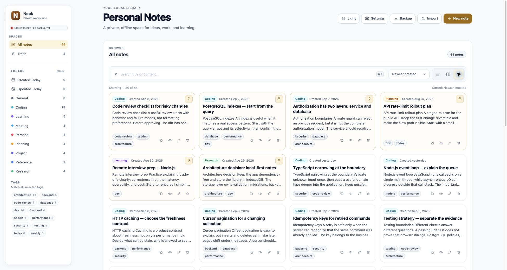
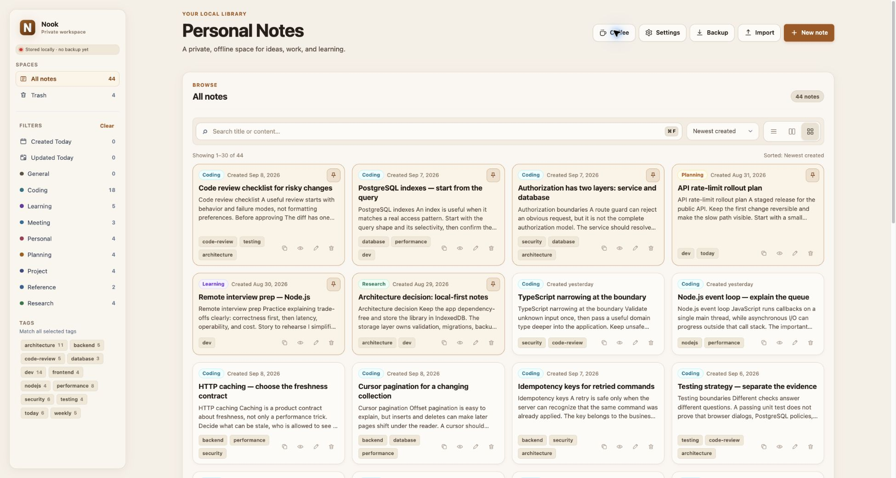
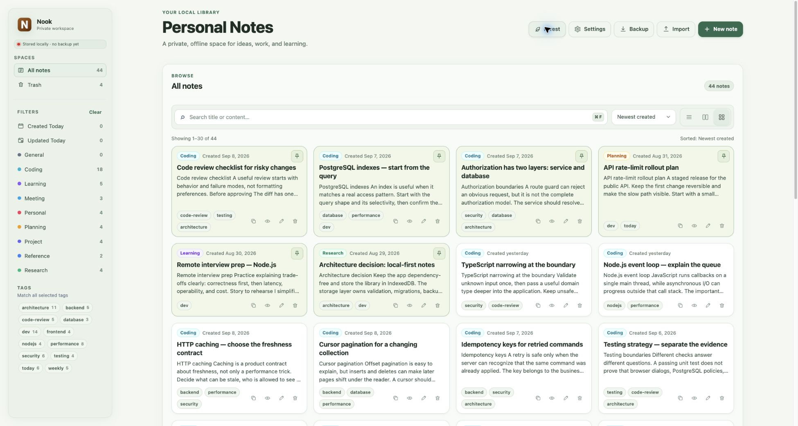
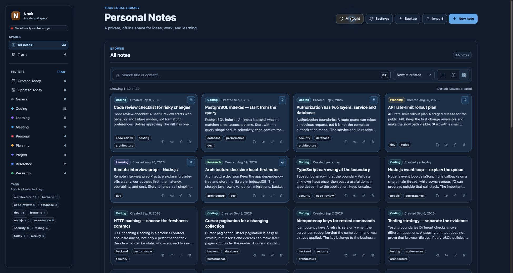
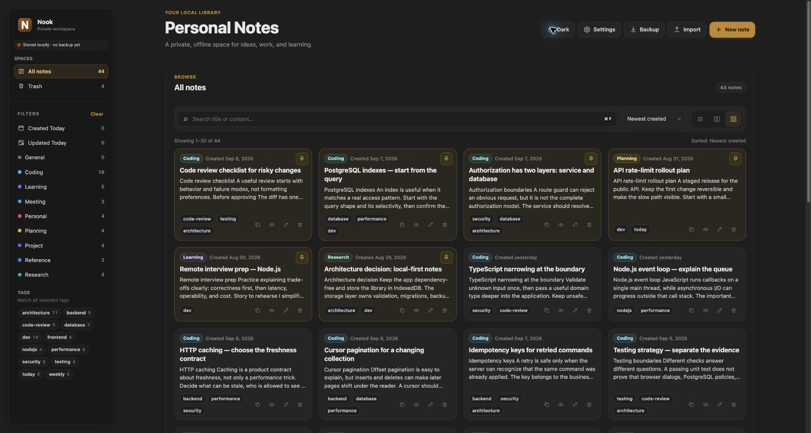
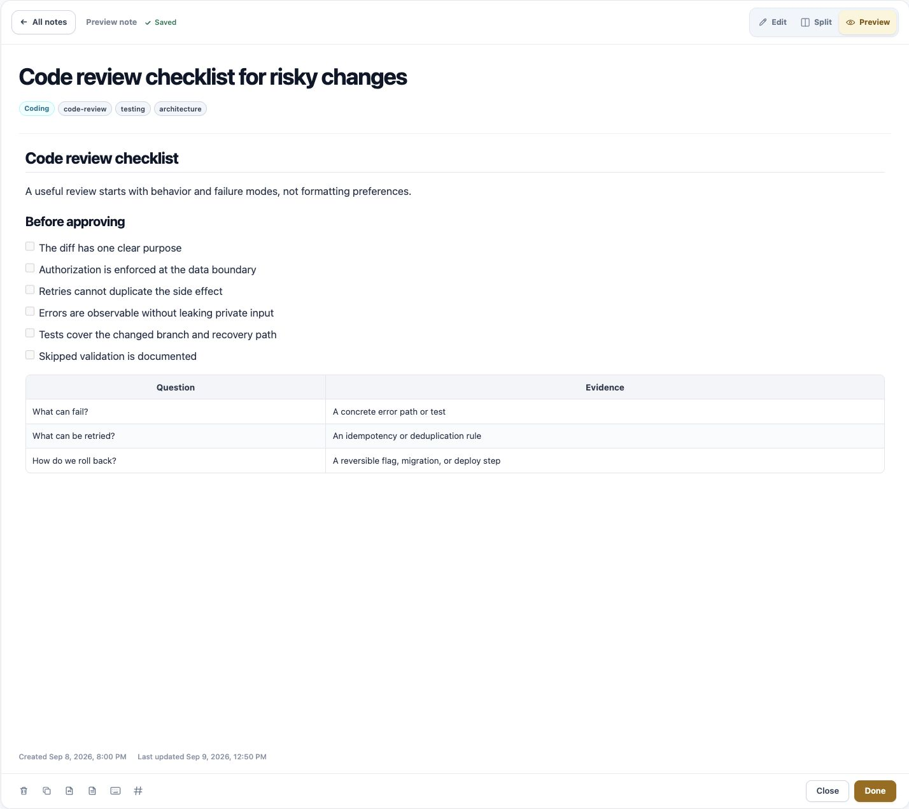
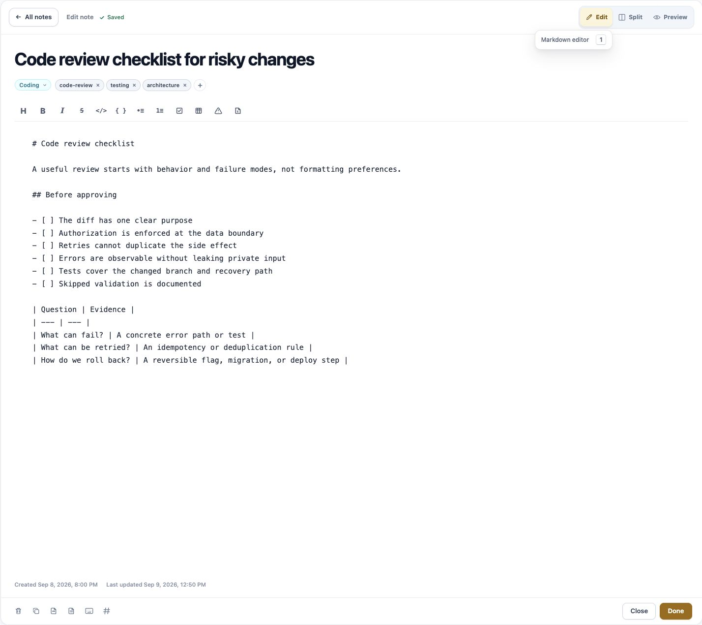
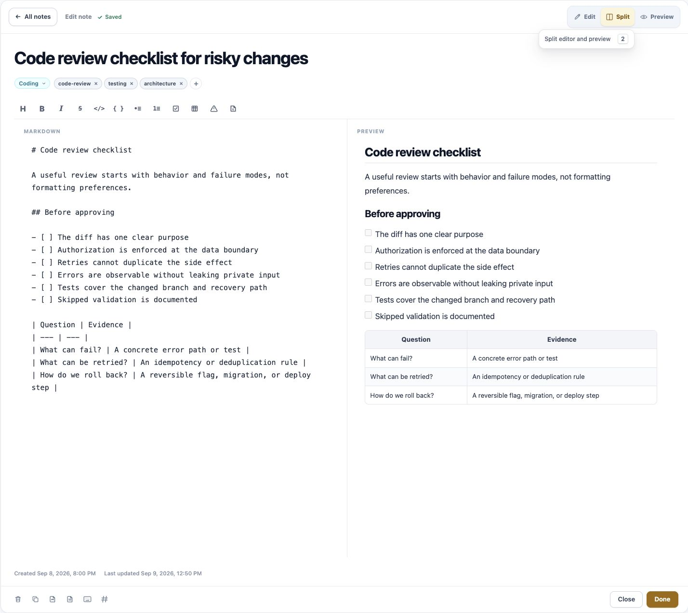
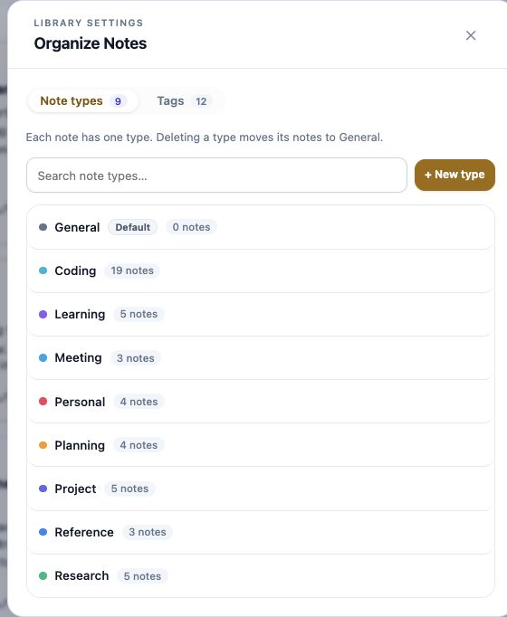
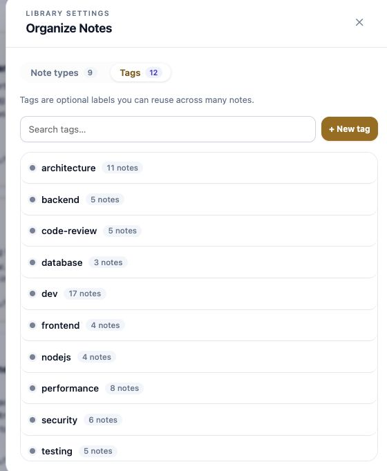

# Nook

[](#development-and-validation)
[](js/)
[](js/storage.js)
[](LICENSE)

Nook is a private, offline-first personal notes workspace. It is a static web
app made with vanilla HTML, CSS, and JavaScript. Notes stay in the current
browser's IndexedDB; there is no account, backend, sync service, analytics,
CDN, or runtime dependency.

Use it for work notes, learning material, research, project context, interview
practice, and personal ideas in one calm, searchable local library.

## Table of contents

- [Highlights](#highlights)
- [Screenshots](#screenshots)
- [Quick start](#quick-start)
- [Browser support](#browser-support)
- [Using Nook](#using-nook)
- [Productivity workflows](#productivity-workflows)
- [Markdown support](#markdown-support)
- [Local data and privacy](#local-data-and-privacy)
- [Offline access and storage health](#offline-access-and-storage-health)
- [Limitations and FAQ](#limitations-and-faq)
- [Backup, restore, and demo data](#backup-restore-and-demo-data)
- [Project structure](#project-structure)
- [Development and validation](#development-and-validation)
- [Feedback and contributing](#feedback-and-contributing)
- [License](#license)

## Highlights

- Create and edit notes with a title, one note type, optional reusable tags, and raw Markdown.
- Open a note in the detail workspace and switch between Preview, Edit Markdown, and Split views.
- Search note titles and content without sending data anywhere.
- Combine type, multiple-tag, Created Today, Updated Today, and search filters. Multiple tags use an “all selected tags” match.
- Sort by created date, updated date, or title. Pinned notes stay above unpinned notes.
- Move notes to Trash, restore them, undo a move, permanently delete one note, or empty Trash.
- Keep up to 50 earlier saved versions per note, preview them, and restore one without losing the current version.
- Copy the raw Markdown source or export the current note as `.md`.
- Export and import a complete JSON backup, including version history. The local backup-health indicator reminds you when an export is missing or old.
- Keep the primary editor and Side note as independent sessions with per-pane draft recovery and stale-write conflict handling.
- Manage note types and tags from Settings → Organize Notes.
- Choose Light, Coffee, Forest, Midnight, Dark, Retro, E-Ink, or Auto theme, switch between Compact, Comfortable, and Grid layouts, or collapse the sidebar into an icon rail.
- Recover an unfinished local editor draft after an interrupted session.
- Review drafts from closed tabs in Draft Recovery, import several Markdown files, or merge a backup while keeping local notes.
- Use Quick actions, reusable templates, and one Daily note per local calendar date.
- Select notes across pages and filters to export a selection, move to Trash, or restore in bulk.
- Keep multiple open tabs in sync when the browser supports `BroadcastChannel`.
- Use `C` for quick capture plus platform-aware editor shortcuts for formatting, saving, and switching editor modes.

## Screenshots

The gallery uses the reusable [demo library](docs/sample-data/nook-demo-library.json):
44 active notes, 4 notes in Trash, 9 note types, 12 tags, 6 pinned notes, and
18 active Coding notes with realistic Markdown content. The content is synthetic and safe to replace. Nook
stores it in the current browser's IndexedDB; no note content is sent to a
server.

Full-library screenshots use one consistent desktop setup: Chrome at 125% zoom,
the Compact four-column layout, and an expanded sidebar. The demo fixture keeps
the sidebar to 12 tags so the tag list fits without an internal scrollbar.

### Library theme gallery











### Note detail workspace







### Settings and recovery UI





## Quick start

Nook has no build step and no package installation. Open [`index.html`](index.html)
directly in a modern browser:

```text
index.html → Open with your browser
```

For a consistent localhost origin, you can optionally serve the repository with
any static web server:

```bash
cd nook
python3 -m http.server 8000 --bind 127.0.0.1
```

Then open <http://localhost:8000>. JavaScript is required in both modes.

`file://`, `localhost`, and different ports are separate browser origins, so
their IndexedDB and localStorage data do not transfer automatically. Export a
JSON backup before moving between origins, browsers, or browser profiles. The
Service Worker is optional and is used only on HTTPS, `localhost`, or
`127.0.0.1`; direct `file://` use remains supported without it.

## Browser support

Nook relies on modern Web APIs and runs without compilation. It requires a browser that provides:

- **IndexedDB**: For local data persistence.
- **`<dialog>` element**: For native accessible modals.
- **`localStorage`**: For UI preferences and unfinished editor recovery when available.
- **`BroadcastChannel`**: Optional same-origin tab notifications; the app still works without it.
- **`navigator.storage`** and **Service Worker**: Optional storage-health and hosted offline capabilities.

Application code uses classic `<script>` tags and a small registry; it does not
require native ES Modules, a bundler, or a package install. Browser support is
feature-based rather than a claim that every browser/version has been fully
validated.

## Using Nook

### Create and edit a note

1. Select **New note**.
2. Enter a title and choose a note type.
3. Add existing tags or type a new tag and press Enter.
4. Write raw Markdown in the editor.
5. Select **Done** to save and close, or **Save changes** to save while keeping the editor open.

Opening a saved note's Preview action takes you to the detail workspace. Use
**Edit**, **Split**, and **Preview** in the command bar to change the surface
without losing the note context. The back action returns to the library and
restores the previous scroll position when possible.

Existing titled notes autosave after about 1.5 seconds of inactivity. A new
untitled draft is not persisted until its first explicit save. Nook keeps the
primary editor and Side note in separate editor sessions. Each session tracks
its committed snapshot, draft, save sequence, base revision, and conflict
state; a late save result cannot overwrite a newer session or draft.

Unfinished drafts are stored locally in separate, per-tab/per-pane recovery
records. A tab keeps its recovery identity in `sessionStorage`, so reloading it
does not make it claim or discard another open tab's draft. Draft Recovery lists
unfinished drafts from all tabs, including closed tabs, and records expire after about 30 days.
Closing a dirty editor asks before discarding changes.
Recovery records are not part of a JSON backup. Conflict context survives a
reload; recovering a draft is not permission to overwrite another saved version.

If another tab or pane saves the same note first, Nook reports a conflict and
keeps the local draft. **Keep editing** leaves the draft untouched, **View
latest** previews the newer committed note, and **Keep mine** retries with the
latest revision as the new comparison point. If the saved note was deleted,
Nook replaces the unavailable actions with **Save as new**. The conflict flow
does not silently overwrite either copy.

### Find and organize notes

- Search the title and raw Markdown content from the library search field.
- Choose a type from the sidebar or from a note card's type badge.
- Select one or more tags. A note must contain every selected tag to match.
- Use **Created Today** or **Updated Today** for date-based review.
- Remove filters from the active-filter pills or select **Clear**.
- Choose a sort order from the toolbar. Pinned notes remain above unpinned notes.
- Use **Compact**, **Comfortable**, and **Grid** to change the card layout.
- On narrow screens, open **Filters** to reveal spaces, date filters, types, and tags without leaving the library.
- Use the sidebar toggle to keep the navigation available as a narrow icon rail.

**Settings → Organize Notes** lets you add, rename, recolor, and delete note
types and tags. Every note has one type. The built-in **General** type cannot be
deleted; notes from a deleted custom type move to General. Tags are optional and
can be shared by many notes.

### Quick View and note actions

The detail workspace provides:

- **Copy** — copies the raw Markdown source.
- **Export `.md`** — downloads the original Markdown.
- **Edit**, **Split**, and **Preview** — switch the current detail surface.
- **Close** — returns to the library.

The pin control is available on each active note card. In Trash, a note can be
restored or permanently deleted. Moving a note to Trash is recoverable until it
is permanently deleted or Trash is emptied.

### Version history

Open **Version history** from the primary note detail workspace or the Side
note. Earlier committed versions are listed newest first and can be previewed
before restore. Nook retains at most 50 versions and 5 MiB of version content
per note. Restoring archives the current note first and then creates a new
current revision, so the current state is not silently discarded. Save or close
an unfinished draft before restoring history.

The Side note is an independent pane in the detail workspace. The active pane
is selected by focus or pointer interaction. Mode shortcuts (`1`, `2`, `3`),
formatting shortcuts, and save shortcuts route to that active pane; each pane
has its own autosave, recovery record, conflict state, and history action.

### Themes

Nook has a light, clean interface by default. You can use the theme button (or `T`) to cycle between eight
modes: Light, Coffee, Forest, Midnight, Dark, Retro, E-Ink, and Auto. Auto matches
your device's system color scheme preference (Light or Dark). Hover over or keyboard-focus the button to see the
current and next theme. Auto stays selected after reload and updates when the system theme changes.

### Keyboard shortcuts

The modifier is `Command` on macOS and `Control` on Windows/Linux.

| Context | Shortcut | Action |
| --- | --- | --- |
| Library | `⌘/Ctrl + F` or `/` | Focus search when no modal dialog is open |
| Library | `C` | Start a new note when focus is not inside a form field |
| Library | `V` | Preview the note card currently under the pointer |
| Library | `1` / `2` / `3` | Switch to Compact / Comfortable / Grid layout |
| App | `⌘/Ctrl + \` | Toggle the sidebar when no modal dialog is open |
| App, outside form controls | `T` | Cycle to the next theme |
| Library / Settings | `S` | Open or close Settings |
| Active note editor pane | `1` / `2` / `3` | Switch to Markdown / Split / Preview mode |
| Active note editor pane | `⌘/Ctrl + B` | Toggle bold around selected editor text |
| Active note editor pane | `⌘/Ctrl + I` | Toggle italic around selected editor text |
| Active note editor pane | `⌘/Ctrl + K` | Insert a link around selected editor text |
| Active note editor pane | `⌘/Ctrl + E` | Toggle inline code around selected editor text |
| Active note editor pane | `⌘/Ctrl + Shift + 7` | Toggle a numbered list on the selected lines |
| Active note editor pane | `⌘/Ctrl + Shift + 8` | Toggle a bullet list on the selected lines |
| Active note editor pane | `⌘/Ctrl + Shift + S` | Save changes and keep the pane open |
| Active note editor pane | `⌘/Ctrl + Enter` | Save changes and close the pane |
| Note view / dialog | `Esc` | Close the current view or dialog |

The complete shortcut reference is available in Settings. Shortcut and Markdown
help also remain available from the editor footer through hover and keyboard
focus. Plain keys are scoped away from editable fields so typing inside a note
is unaffected. Version history is opened with its note action rather than a
global keyboard shortcut.

## Productivity workflows

### Quick actions

Select **Actions** in the library/editor to open Quick actions, or press **Cmd/Ctrl+Shift+P**.
Search saved notes by title/content and open one, or run actions such as New
note, Daily note, Templates, Draft Recovery, import, backup, and Settings.
The search stays above separately labeled action and note groups; keyboard hints
and the active library's note count stay in the footer while results scroll.
Arrow keys choose a result and Enter opens it. Note results cover the whole
active library independently of current filters; Trash notes are excluded.
The first 30 matching notes are shown. Narrow the search for more results.
Switching notes protects unfinished drafts in both panes. Save/template actions
use the active pane when a Side note is open.

### Draft Recovery

Open **Draft Recovery** from Quick actions, Settings → Data, or the **Recover
drafts** indicator in the library. Every retained primary/Side-note recovery
record in this browser is available, including drafts from closed tabs.

- **Recover draft** opens the draft in the primary editor. A missing or trashed
  original becomes a new draft. A changed original requires explicit conflict
  resolution before any overwrite; recovery does not automatically save.
- **Save as new** saves a separate note. The original saved note stays intact.
  Missing types fall back to General and missing tags are omitted.
- **Export .md** requests a download of the raw draft and keeps it locally.
- **Discard** requires confirmation and removes only that recovery draft.

A source record stays until successful save or explicit discard. If it has
changed in another tab, the newer record is kept. Drafts detected as still open
can be copied/exported, but cannot be claimed or discarded from the center.
Tab presence is best effort and may be delayed by browser background throttling.
Keep important drafts in a saved note or downloaded file; recovery uses
localStorage and is not a substitute for backup.

### Markdown import

Select **Import Markdown files** in Quick actions or **Choose files** under
Settings → Data → Import Markdown. Choose up to 100 `.md`/`.markdown` files
and 10 MB per batch. Preview the titles and source, choose one note type, then
import. File names without extensions become titles; front matter and Markdown
stay in the content rather than being interpreted as metadata. Each file is
limited to 200 KB and the normal 50,000-character content limit. All files are
validated before one atomic write; a rejected file leaves the library intact.

### Templates and Daily notes

Open **Templates** from Quick actions. Meeting, Learning, and Daily reflection
are available as built-in starters. **New template** opens a draft tagged
`template`; **Save current note as template** saves a separate copy. Edit or
Trash custom templates like ordinary notes. They are included in JSON backups.
Using a template copies its type, tags, and raw Markdown into a new draft,
removes the `template` tag, and expands `{{date}}` (local YYYY-MM-DD) and
`{{time}}` (local HH:mm). The source template is kept intact.

**Open today's Daily note** creates or reopens one note per local calendar
date. Its stable date ID survives title edits and JSON restore. It starts with
Focus, Notes, and Reflection sections and the `daily-note` tag. If that Daily
note is in Trash, restore it before reopening it; Nook does not silently create
another copy.

### Select multiple notes

On desktop, choose **Select** in the layout control group and check the
notes you want. **Select all (count)** adds all notes matching the current filters,
including other pages. Once every result is selected, it becomes **Deselect all**
and removes those results from the selection, keeping selections outside the
current filters. Unchecking an individual result returns the button to **Select all**.
The count includes notes selected under previous filters. Switching between
All notes and Trash clears the selection.

Selection is hidden on mobile (820px and below), including the toolbar,
card checkboxes, and Actions entry. Narrowing a desktop window suspends the
selection UI; returning to desktop restores the existing selection. Actions
already in progress continue safely. Individual note actions remain available
on mobile.

The Select/layout group expands into the selection toolbar in the same header
position while selection is active, without adding a row below the header.
The count includes selections across pages and filters; hover it for that context.

**Export** downloads
only the selected notes and their history as JSON in the existing
backup format, with the library's type/tag catalog; it does not reset the full
library backup indicator. **Trash** and **Restore** require
confirmation. Batch changes check every selected note's revision and original
fields in one transaction. A changed note cancels the complete action; reselect
the latest records before retrying. The toolbar's **Done selecting** close button
clears the selection and returns the Select notes button. Change note types and
tags in each note's editor; the selection toolbar does not edit note fields.

## Markdown support

Nook includes a dependency-free, safe Markdown-to-DOM renderer. It supports a
broad CommonMark/GFM-style subset, including:

- ATX and setext headings; bold, italic, strikethrough, inline code, entities, and hard line breaks
- Fenced and indented code blocks with an optional language label
- Unordered, ordered, nested, and task lists
- Blockquotes and GitHub-style alerts: `NOTE`, `TIP`, `IMPORTANT`, `WARNING`, and `CAUTION`
- Inline links, reference links, autolinks, and safe `http`, `https`, `mailto`, and `tel` destinations
- Tables with alignment, footnotes, allowlisted `<details>`/`<summary>` blocks, and mathematical-expression text blocks
- Horizontal rules

This is not a claim of complete GitHub renderer parity. Math is displayed as
text rather than typeset. Remote images are represented by accessible alt text
so Nook does not load untrusted image assets. Raw HTML remains inert except for
the explicitly supported details/summary syntax, and unsafe URL schemes are
not rendered as links.

Rendering is bounded for safety: sources over 5,000 lines or block/inline
nesting deeper than 24 levels fall back to an inert `<pre>` containing the raw
source. Footnote definitions and references are scoped to one render call, and
generated footnote IDs include a render-specific scope so previews in different
surfaces cannot collide.

## Local data and privacy

Nook keeps the note library in the current browser profile:

- IndexedDB database: `personal-notes`
- Current database version: `3`
- Object stores: `notes`, `types`, `tags`, `noteVersions`, and `meta`
- UI preferences such as theme, sidebar state, layout, sort order, and active filters use `localStorage`
- Unfinished primary/Side note drafts use per-session `localStorage` recovery records; they are not part of IndexedDB or backups

The app does not send note content to a server and does not call external APIs.
Browser site data is not a backup: clearing site data, changing browser
profiles, or using another browser can make the local library unavailable. JSON
backups are plain text and are not encrypted by Nook.

### Note data model

Each note contains:

| Field | Description |
| --- | --- |
| `id` | Stable local note identifier |
| `title` | Required title, up to 160 characters |
| `typeId` | Required reference to one note type |
| `tagIds` | Zero or more tag references |
| `content` | Raw Markdown, up to 50,000 characters |
| `createdAt` | ISO timestamp |
| `updatedAt` | ISO timestamp |
| `isPinned` | Whether the note is pinned |
| `deletedAt` | ISO timestamp when in Trash, otherwise `null` |
| `revision` | Positive integer incremented by each committed mutation; used for stale-write detection |

The storage layer owns normalization and validation. Note content preserves
leading/trailing whitespace and normalizes CRLF line endings before saving;
the Markdown syntax is preserved.
Editor saves compare an optional `expectedRevision` in the same IndexedDB
transaction that writes the note. A mismatch raises `NOTE_CONFLICT` with the
latest stored note; a semantic no-op does not create a revision or history row.

Each `noteVersions` record is a committed note snapshot keyed by
`<noteId>::<revision>`. Actual saves archive the previous current snapshot
before writing the next revision. Pin, Trash, type, and tag mutations also use
the revision/history path where they change the stored note. History keeps the
newest 50 snapshots and at most 5 MiB of UTF-8 content per note.

The UI uses only the frozen global `PersonalNotesStorage` API. Application
modules do not open IndexedDB directly.

## Offline access and storage health

Nook remains usable as a static `file://` site. A Service Worker is not
registered there. On HTTPS, `localhost`, or `127.0.0.1`, Nook may register the
versioned local-resource cache in `sw.js` and reopen the app offline after the
assets have been cached. Other hosted origins keep local IndexedDB behavior but
do not receive this Service Worker path.

On a supported desktop browser, open Settings → Data and choose **Install app**
when it is available. Nook then opens in a standalone window and receives its
own desktop, dock, or app-launcher icon. Browsers that do not expose the in-app
prompt may offer **Install App** or **Add to Dock** in their own menu. Standard
PWA installation requires HTTPS or localhost and is not available from
`file://`.

When a new worker is waiting, Nook offers **Apply update**. It does not force a
reload while the primary editor or Side note has unsaved changes; save or
preserve those drafts first. The worker is activated only after an explicit
request, and a reload is performed only when no active draft remains.

The Settings storage panel uses `navigator.storage.estimate()` and
`navigator.storage.persisted()` when available. It reports usage/quota when the
browser exposes them and offers a best-effort `navigator.storage.persist()`
request. A granted persistent-storage flag can reduce eviction risk but is not
guaranteed, does not increase the browser's quota contract, and never replaces
a separate JSON backup. Unsupported or failed APIs are reported without
changing note data.

## Limitations and FAQ

- **Will I lose my notes if I clear browser data?** Yes. Nook strictly relies on the browser's IndexedDB. If you clear "Site Data" or use strict anti-tracking modes that clear local data on exit, your notes will be permanently deleted. Regularly export JSON backups.
- **Does it sync across my devices?** No. Nook is purely local to the current browser profile. To move data, export a backup on one device and import it on the other.
- **Storage Limits**: Browsers may cap IndexedDB storage or automatically evict it if the OS runs out of disk space. For raw Markdown notes, you are highly unlikely to hit size limits, but eviction remains a risk on full disks.

## Backup, restore, and demo data

### Full library backup

Select **Export backup** in Settings → Data, or **Export library backup** in
Quick actions, to request a browser download named like
`personal-notes-backup-YYYY-MM-DD.json`. The current format is:

```json
{
  "format": "personal-notes-backup",
  "schemaVersion": 3,
  "exportedAt": "2026-01-01T00:00:00.000Z",
  "data": {
    "noteTypes": [],
    "tags": [],
    "notes": [],
    "noteVersions": []
  }
}
```

The download action creates a local Blob and asks the browser to download it;
the browser may still block or redirect the download, so confirm that the file
appears before deleting local data. The backup contains notes, types, tags,
Trash state, and retained version history. Unfinished editor recovery drafts
are intentionally excluded.

Select **Import backup** in Settings → Data or **Import or merge backup** in
Quick actions to inspect a JSON file. **Add to library** is the default. Matching
type/tag names reuse local records; new names are added with safe ID remapping.
Identical notes with matching IDs are skipped. For differing notes with the
same ID, choose **Keep both** (import a copy, including its history) or **Keep
local** (skip the incoming note). Local notes are never overwritten by merge.
If the library changes after preview, inspect the file again before importing.

**Replace library** is still available after an explicit confirmation. It
replaces notes, types, tags, and history in one atomic IndexedDB transaction.
Save or close dirty primary/Side note drafts first. Both modes validate before
writing, support older backups, and keep recovery drafts outside the backup.
The file picker accepts JSON backups up to 50 MB. Merge is limited to 10,000
notes, types, and tags in the resulting library, matching the backup parser.

The [Nook demo library](docs/sample-data/nook-demo-library.json) is a reusable,
fictional sample collection for reviewing the UI, practicing import/export, and
refreshing the README gallery. It contains active notes plus four Trash records
so restore and permanent-delete states are available immediately. Import it
from the app's **Import** button whenever you need the same demo state again.

Nook exports schema version `3` and accepts schema versions `1`, `2`, and `3`,
including the older `types` naming in place of `noteTypes`. It also accepts the
legacy library shape containing `interviewQuestions` and `protoblocNotes`.
Legacy and older backups are upgraded into the current note/type/tag model;
older notes begin at revision 1 and have no history until a new committed
mutation occurs.

## Project structure

| File | Responsibility |
| --- | --- |
| [`index.html`](index.html) | Semantic page structure, accessible controls, detail workspace, and native dialogs |
| [`css/app.css`](css/app.css) | Shared cascade manifest for foundations, components, features, and accessibility |
| [`css/`](css) | Stylesheets organized by component, feature, responsive, accessibility, and theme ownership |
| [`js/storage.js`](js/storage.js) | IndexedDB v3 setup, validation, migration, revisioned CRUD, history, Trash lifecycle, and backup import/export |
| [`js/markdown.js`](js/markdown.js) | Safe dependency-free Markdown parser and DOM renderer |
| [`js/app/runtime.js`](js/app/runtime.js) | Registers application modules and initializes them in an explicit dependency order |
| [`js/app/elements.js`](js/app/elements.js) | Cached DOM references |
| [`js/app/core.js`](js/app/core.js) | Shared application state, constants, stored preferences, and pure UI helpers |
| [`js/app/local-state.js`](js/app/local-state.js) | Legacy recovery compatibility and backup health |
| [`js/app/search.js`](js/app/search.js) | Search indexing/highlighting, filter primitives, ordering, and query scheduling |
| [`js/app/library-sidebar.js`](js/app/library-sidebar.js) | Sidebar filters, metadata badges, and card tag fitting |
| [`js/app/library.js`](js/app/library.js) | Note cards, pagination, Trash presentation, and sort controls |
| [`js/app/workspace.js`](js/app/workspace.js) | Primary note preview, detail workspace, and workspace transitions |
| [`js/app/clipboard.js`](js/app/clipboard.js) | Raw-Markdown copy and transient copy feedback |
| [`js/app/side-note.js`](js/app/side-note.js) | Side note navigation and its DOM/editor adapter |
| [`js/app/note-pickers.js`](js/app/note-pickers.js) | Shared type/tag picker components and both panes’ picker rendering |
| [`js/app/formatting.js`](js/app/formatting.js) | Markdown editing operations and mobile formatting scroll cues |
| [`js/app/split-scroll.js`](js/app/split-scroll.js) | Split preview rendering and scroll mapping/synchronization |
| [`js/app/editor.js`](js/app/editor.js) | Primary DOM/editor adapter, autosave, validation, and mode controls |
| [`js/app/theme-config.js`](js/app/theme-config.js) | One theme catalogue for startup, preferences, labels, assets, and legacy aliases |
| [`js/app/pane-controller.js`](js/app/pane-controller.js) | Shared pane session, save, conflict, and recovery lifecycle |
| [`js/app/onboarding.js`](js/app/onboarding.js) | Dismissible local-data introduction and explicit ordinary guide-note creation |
| [`js/app/contracts.d.ts`](js/app/contracts.d.ts) / [`jsconfig.json`](jsconfig.json) | Checked controller/theme contracts, without changing runtime JavaScript |
| [`js/app/editor-session.js`](js/app/editor-session.js) | DOM-independent primary/Side note session state, CAS saves, conflict state, and per-session draft recovery |
| [`js/app/note-actions.js`](js/app/note-actions.js) | Shared pin, Trash, restore, permanent-delete, and undo mutations |
| [`js/app/split-selection.js`](js/app/split-selection.js) | Split-mode source/preview selection highlighting |
| [`js/app/history.js`](js/app/history.js) | Version-history preview and restore controller |
| [`js/app/offline.js`](js/app/offline.js) | Optional storage-health, persistent-storage request, and hosted Service Worker update controls |
| [`js/app/mobile.js`](js/app/mobile.js) | Responsive control placement, mobile sheets, and Back-button guards |
| [`js/app/recovery.js`](js/app/recovery.js) | All-tab Draft Recovery, safe source cleanup, and best-effort tab presence |
| [`js/app/data-import.js`](js/app/data-import.js) | Markdown multi-file import and backup merge/replacement inspection |
| [`js/app/productivity.js`](js/app/productivity.js) | Quick actions, guarded navigation, templates, Daily notes, and shared workflow dialogs |
| [`js/app/bulk-actions.js`](js/app/bulk-actions.js) | Selection across pages/filters, batch changes, and selection export |
| [`css/workflows.css`](css/workflows.css) | Theme-aware workflow dialogs and bulk-selection surfaces |
| [`scripts/test-maintainability.cjs`](scripts/test-maintainability.cjs) | Optional Chromium checks for onboarding, theme aliases, sidebar restoration, settings menus, and mobile formatting |
| [`scripts/test-workflows.cjs`](scripts/test-workflows.cjs) | Optional Chromium storage/UI regression checks using isolated synthetic data |
| [`scripts/update-service-worker-cache.cjs`](scripts/update-service-worker-cache.cjs) | Recomputes the cache fingerprint from all hosted app assets |
| [`sw.js`](sw.js) | Versioned cache for local hosted app resources; never owns note data |
| [`manifest.webmanifest`](manifest.webmanifest) | Local install metadata for hosted browsers |
| [`icons/`](icons) | Local PNG application icons used by installed browsers and operating systems |
| [`js/app/`](js/app) | UI modules split by responsibility: shared state, preferences, feedback, library, editor, settings/import-export, tab sync, offline capabilities, and event/bootstrap wiring |
| [`docs/architecture.md`](docs/architecture.md) | Module boundaries, CSS ownership, extension rules, and structural validation |
| [`favicon.svg`](favicon.svg) | Local Nook application icon used by the browser tab |
| [`docs/sample-data/nook-demo-library.json`](docs/sample-data/nook-demo-library.json) | Reusable fictional import/export fixture for demos and screenshot QA |
| [`LICENSE`](LICENSE) | Unlicense / public-domain dedication |

The head loads the classic-script registry and the shared theme catalogue before
first paint. The body loads storage, Markdown, and feature registrations:

```text
head: runtime.js → theme-config.js
body: storage.js → markdown.js → classic-script registrations
```

`js/storage.js` exposes the frozen `PersonalNotesStorage` API and
`js/markdown.js` exposes the frozen `NookMarkdown` API. The application modules
register installers in any script-tag order. `runtime.js` initializes them as
`theme-config → elements → core → local-state → search → preferences → feedback → editor-session → pane-controller → note-actions → library-sidebar → library → workspace → clipboard → side-note → note-pickers → split-scroll → formatting → editor → split-selection → history → organize → sync → offline → mobile → recovery → data-import → productivity → bulk-actions → onboarding → events`, reports missing or duplicate modules and conflicting API ownership, and
`events.js` removes the temporary registry before bootstrap. This is a
classic-script registry, not an ES Module graph. The UI continues to use the
storage API instead of accessing IndexedDB directly.

`index.html` loads `css/app.css`, one active theme stylesheet, then `css/mobile.css`,
detail typography, and workflow styles.
This keeps inactive theme rules out of the parsed cascade while preserving the
existing order; selectors remain in their owning stylesheet. See
[`docs/architecture.md`](docs/architecture.md) before adding a module, moving a
selector, or introducing a cross-layer override.

## Development and validation

Agents and contributors should start with [AGENTS.md](AGENTS.md) and the
[agent guide](docs/agent-guide.md) for the reading order, code ownership, coding
conventions, UI/CSS rules, and change-validation workflow.

There is no `package.json`, bundler, framework, or remote runtime dependency.
The regression tests use Node's built-in `node:test` module. If TypeScript is
already available as a development tool, `tsc -p jsconfig.json` checks the shared
pane and theme boundaries. It emits no files and adds no browser dependency; it
does not type-check every legacy module. Useful checks are:

```bash
node --check js/storage.js
node --check js/markdown.js
for file in js/app/*.js; do node --check "$file"; done
node --test tests/*.test.js
node scripts/update-service-worker-cache.cjs
git diff --check
```

For the focused refactor/UI checks, run `node scripts/test-maintainability.cjs`
under the same optional local Node 20+/Playwright setup. Set `NOOK_SCREENSHOT_DIR`
to retain screenshots in a temporary directory. These checks cover first-use
state, explicit guide creation, theme aliases, temporary sidebar collapse and
manual preference changes, safe pane close/save, settings menus, and seven
themes at mobile widths.

For the productivity workflows, run `node scripts/test-workflows.cjs` with
Node 20+ and Playwright already available locally. Alternatively set
`NOOK_PLAYWRIGHT_MODULE` to a locally installed Playwright module path. No
dependency is loaded into the app. The script starts its own localhost server,
uses fresh Chromium contexts with synthetic data, and closes them afterward.
It checks import atomicity, merge conflicts/history, stale batch rejection,
templates, Daily note identity, draft recovery across tabs/reload, responsive
layouts, themes, hosted offline reopen, and static file mode. It does not prove
Safari, Firefox, device hardware, or storage-quota behavior.

Run the cache update script after changing any hosted HTML, CSS, JavaScript,
font, icon, manifest asset, or Service Worker behavior. The regression test
recomputes the same fingerprint and fails if the cache version or asset manifest
is stale. Worker installation bypasses an older HTTP cache before populating the
new versioned cache.

The Node suite verifies Service Worker asset completeness, cache fingerprints,
installation, activation cleanup, theme loading, and note-action behavior. The
storage contract harness is `tests/browser/storage-harness.html`; run its
`v1`, `v2`, `save`, `bytes`, and `backup` scenarios on a fresh isolated
localhost origin. The EditorSession and Markdown harnesses cover their own
boundaries. These harnesses do not prove full application startup, two-tab
rendering, a real-browser cross-release Service Worker activation, quota grants,
or responsive and accessibility QA.

When changing behavior, manually exercise the affected flow through a local
server or by opening `index.html`. For editor and responsive changes, check new
notes, existing notes, dirty-draft confirmation, keyboard focus, sidebar state,
and a narrow mobile viewport. For storage changes, check save, Trash restore,
permanent deletion, import/export, validation, and backward-compatible data.

Keep changes focused and preserve the offline-only boundary. Do not add hosted
fonts, CDNs, analytics, authentication, external APIs, or a framework without
an explicit product decision.

## Feedback and contributing

Nook is built to serve a highly specific personal workflow. While major feature requests or large pull requests are generally not accepted to keep the app focused and dependency-free, bug reports are welcome. Feel free to open an issue if you encounter unexpected behavior.

## License

Nook is released under the [Unlicense](LICENSE). It is provided without
warranty; see the full license text for details.
